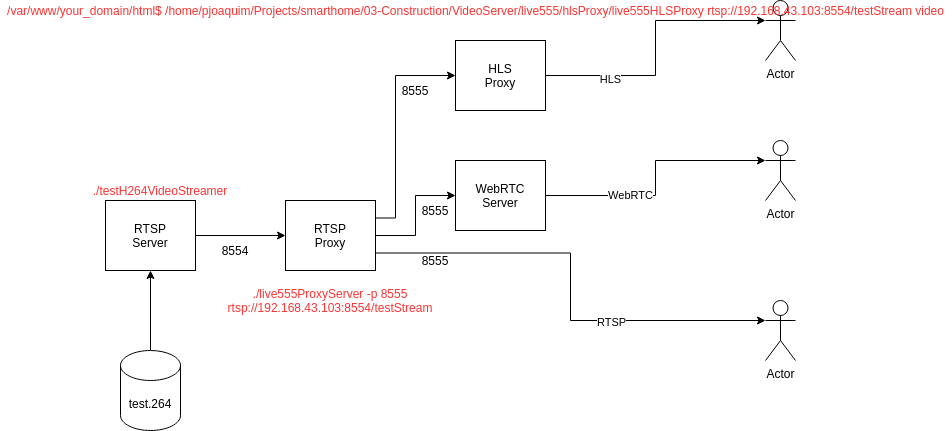

# poc-smarthome-livestream-service

This POC is intended to have an endpoint for an RTSP stream, another for HLS, and another for the webrtc.

NOTE: The following documentation is using localhost as the IP to look for. If necessary replace it with the host machine IP.

## Building and Running the docker
Build the docker provided. Is recommended to use a version in major.minor form->  x.y)

> docker build -t livestream:x.y .

> sudo docker run -it -p <RTSP_PORT>:8555 -p <HLS_PORT>:80 -p <WEBRTC_PORT>:8088 livestream:x.y

example:

> docker build -t livestream:1.1 .

> sudo docker run -it -p 50055:8555 -p 81:80 -p 8088:8088 livestream:1.1

## Playing the RTSP stream
Open the VLC and play the stream from the following URL:
> rtsp://localhost:RTSP_PORT/proxyStream

Following the above example:
> rtsp://localhost:50055/proxyStream

## Playing the HLS stream
Open the firefox web browser (is necessary to install the "HLS.js Playback" extension) and open the following URL:
> http://localhost:HLS_PORT/video.m3u8

Following the above example:
> http://localhost:81/video.m3u8

## Playing via WebRTC
Open the firefox web browser and open the janus client provided (project_folder/janus-client/streamingtest.html)

Press the Start button and a combo box should appear to let you select the video to play.

IMPORTANT: The streamingtest.js shall be modified (line 49) if the WEBRTC_PORT is different than 8088.

